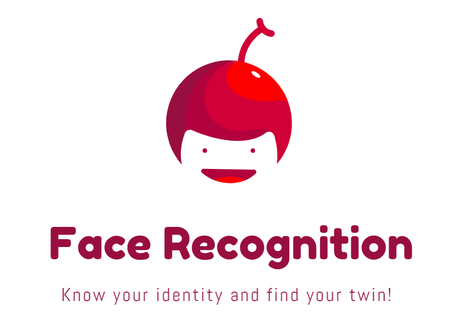

# Face-Recognition-Server-Deployment

<div align="center"></div>

     [](https://elainexhzhong.github.io/)

## Face Recognition using Tensorflow

This is a TensorFlow implementation of the face recognizer described in the paper ["FaceNet: A Unified Embedding for Face Recognition and Clustering"](https://arxiv.org/abs/1503.03832). 

## Compatibility

The code is tested using tensorflow 1.7 (CPU mode) or tensorflow-gpu 1.7 (GPU mode) under Windows 10 with Python 3.6.13 (Anaconda Environment). 

You can create the Anaconda Environment of this project by the following commands:
```bash
$conda create -n facenet python=3.6 && conda activate facenet
$cd facenet
$pip install -r requirements.txt
$pip uninstall -y tensorflow
$pip install tensorflow-gpu==1.7.0
$pip install xlrd==1.2.0
```

Some packages require a specific version for the program to work properly:    

 Note that the training and prediction environment need to be consistent to predict face identity successfully. So don't update or delete packages arbitrarily!

The [GPU Environment Configuration](note/GPU.md) is `Visual Studio 2017 + python 3.6.12 + tensorflow-gpu 1.7.0 + CUDA 9.0 + cuDNN 7.0.5 + facenet site-packages`.

## Milestone
| Date     | Update |
|----------|--------|
| 2021-04-16 | Completed depolyment on Azure GPU VM whose configuration is 24 vCPUs (Xeon(R) CPU), 448G Memory and 4 NVIDIA Tesla V100 card. |
| 2021-04-16 | Added function to find similar face in face recognition model and corresponding APIs and HTML page. |
| 2021-04-13 | Added batch prediction mode code in server and corresponding APIs and HTML page.  |
| 2021-03-23 | Added single prediction mode code in server and corresponding APIs and HTML page. |
| 2021&#8209;03&#8209;20 | Completed training on face recognition classifier model with dedicated face dataset. |

## API Overview

<div align="center"></div>

Click [here](note/API.md) to see API specification.

## Pre-trained models
| Model name      | LFW accuracy | Training dataset | Architecture |
|-----------------|--------------|------------------|-------------|
| [20180402-114759](https://drive.google.com/open?id=1EXPBSXwTaqrSC0OhUdXNmKSh9qJUQ55-) | 0.9965        | VGGFace2      | [Inception ResNet v1](https://github.com/davidsandberg/facenet/blob/master/src/models/inception_resnet_v1.py) |

NOTE: If you use any of the models, please do not forget to give proper credit to those providing the training dataset as well.

## Classifier model

Training classifier model on your own face dataset.

## Inspiration

The code of main server is heavily inspired by the [facenet](https://github.com/davidsandberg/facenet) implementation and [facenet-realtime-face-recognition](https://github.com/tamerthamoqa/facenet-realtime-face-recognition) implementation.

The code of video server is heavily inspired by the [facial-recognition-video-facenet](https://github.com/radykov/facial-recognition-video-facenet) implementation (video recognition), [video_streaming_with_flask_example](https://github.com/log0/video_streaming_with_flask_example) implementation (video streaming online) and [flask-opencv-streaming](https://github.com/desertfury/flask-opencv-streaming) implementation (video streaming online).

## Processing 

Facenet's standard operating procedures and some automation procedures need to be carried out to get the classifier model for back-end server to use for prediction.

### Manual processing

##### 1. Crop from video to images

Install FFmpeg
```bash
$python src/crop.py C:/Users/PC/Desktop/kol_video C:/Users/PC/Desktop/kol_crop
```

##### 2. Detect, extract and align face images

Copy all files (det1.npy, det2.npy, det3.npy) under `src/align/` from facenet to folder `src/align/` except `align_dataset_mtcnn.py` and `detect_face.py`.
```bash
$python src/align/align_dataset_mtcnn.py datasets/kol_crop datasets/kol_160 --image_size 160 --margin 32
$python src/align/align_dataset_mtcnn.py datasets/kol_crop datasets/kol_160 --image_size 160 --margin 32 --gpu_memory_fraction 0.5 # If there is not enough memory in the GPU
```

##### 3. Manually clean the data set

Manually clean data set kol_160: in each subfolder, pictures that are not belong to this KOL (manually delete), pictures with facial occlusion (such as hand occlusion, object occlusion, text GIF occlusion, etc., manually delete), non-face images (manually delete).

##### 4. Train model with face thumbnails

```bash
$python src/classifier.py TRAIN datasets/kol_160 models/20180402-114759/20180402-114759.pb models/kol.pkl
```

##### 5. Validate model with face thumbnails

```bash
$python src/classifier.py CLASSIFY datasets/kol_160 models/20180402-114759/20180402-114759.pb models/kol.pkl
```

##### 6. Predict KOL identity
```bash
$python src/predict.py datasets/kol_160/01/01_0001.jpg models/20180402-114759 models/kol.pkl
$python src/predict.py datasets/kol_160/01/01_0001.jpg models/20180402-114759 models/kol.pkl --gpu_memory_fraction 0.5 # If there is not enough memory in the GPU
```

##### 7. Predict Video identity
```bash
$python src/classifier.py TRAIN datasets/training_data_aligned models/20180402-114759/20180402-114759.pb models/newglint_classifier.pkl
$python src/video_recognize.py
```

### Automatic processing

Simply execute the automatic processing by the following order on the web.

```markdown
1. {Main Server} /trainModel
2. Select: 
    - upload image zip 
    - upload video zip
3. {Process Server} /
4. {Process Server} /processingProgress
5. {Process Server} /align
6. {Process Server} /clean 
7. {Process Server} /import_clean 
8. {Process Server} /import_result 
9. {Process Server} /train_model 
```
**Notice:**
1. In {Process Server} /clean, the number `if dist < 1.06:` is represented by the horizontal distance between the face, when the face distance is smaller than 1.06 can be regarded as the same person.
2. If the GPU memory is not enough, the CPU can be directly used to run by `pip install tensorflow==1.7.0`.


## Start the Server

#### 1. Configure all server

Please edit [`config.ini`](config.ini) which locate in root directory to change the value of shared variable.

Click [here](note/Config.md) to see how to edit `config.ini` file.

#### 2. Start the Main Server
Firstly, quickly start the server from the command:
```bash
$conda activate facenet
$python server.py
```
Secondly, open web browser: `http://127.0.0.1:{main.server.port}` (detail in `config.ini`)

#### 3. Start the Process Server
Copy all files (det1.npy, det2.npy, det3.npy) under `src/align/` from facenet to folder `other-server/process/align` except `align_dataset_mtcnn.py` and `detect_face.py`.

```bash
$cd other-server/process
$python server.py
```

#### 4. Start the Video Server
Copy all files (det1.npy, det2.npy, det3.npy) under `src/align/` from facenet to folder `other-server/video/align` except `align_dataset_mtcnn.py` and `detect_face.py`.

```bash
$cd other-server/video
$python server.py
# you can compare app.py and server.py to obvserve the server performance
```

**Notice:**
1. The conda environment to run server.py must be the one in which the .pkl model is trained.
2. Before run the server, copy folder datasets and models which contains 20180402-114759 to the root directory.
3. In order to display image properly on HTML page, the path of the image needs to be relative path to the root directory for each project (mian or sub).
